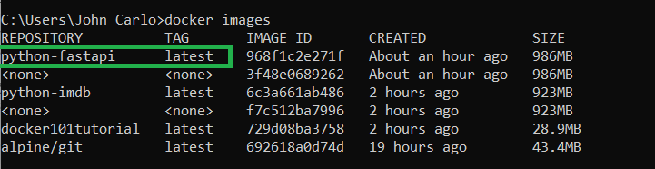
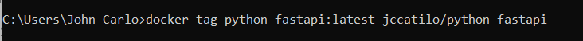
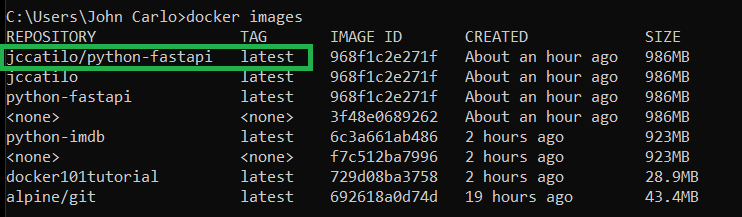
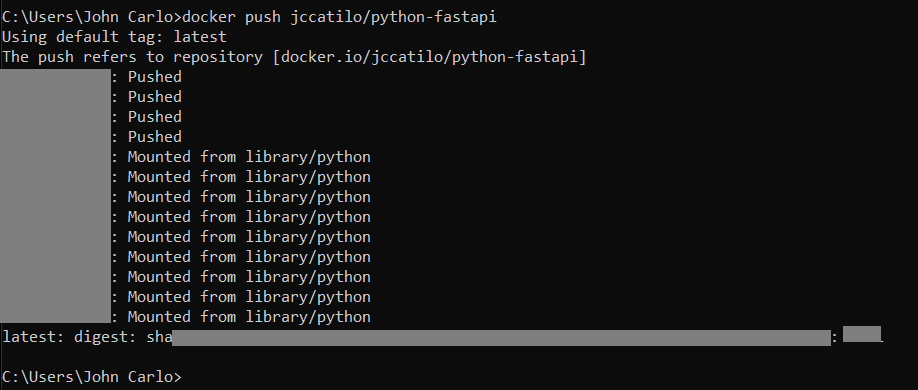
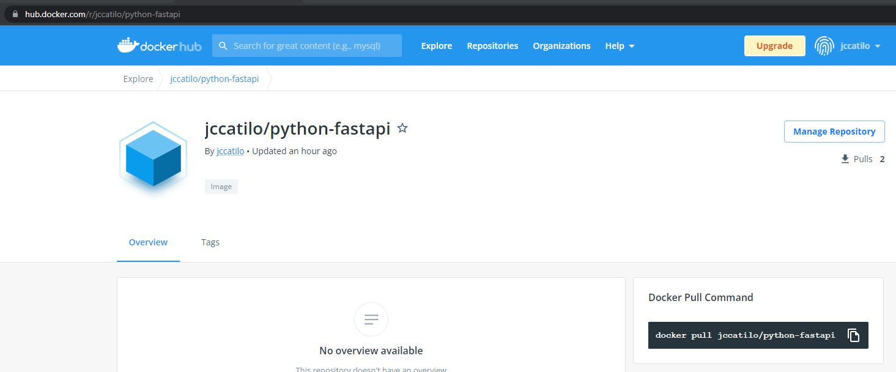
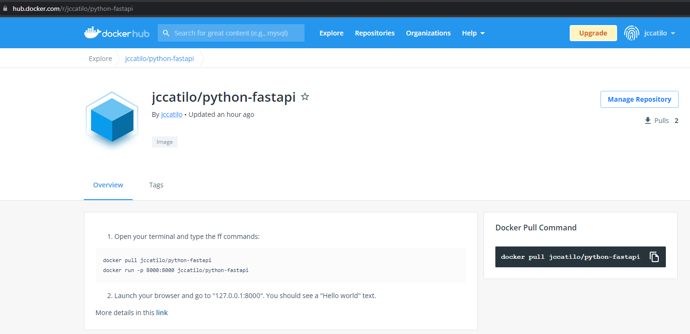

# How to dockerize a python web app that's using FASTAPI.

1. create a virtual environment  using *python -m venv <virtual-environment-name>*

    ```python -m venv venv```

2. activate the virtual environment by typing *.\virtual-env-name\Scripts\activate* . Note that this might be different on linux-based systems.

    ```.\venv\Scripts\activate ```

3. install dependencies of FASTAPI

    ``` pip install fastapi```

    ``` pip install uvicorn```

4. create /app/main.py

5. Grab the example code from the [FAST API website](https://fastapi.tiangolo.com/) but if you will notice I did some modifications. LOL 

    ```
    from typing import Union

    from fastapi import FastAPI

    app = FastAPI()
    import uvicorn

    @app.get("/")
    def read_root():
        return {"Hello": "World"}


    @app.get("/items/{item_id}")
    def read_item(item_id: int, q: Union[str, None] = None):
        return {"item_id": item_id, "q": q}

    if __name__ == '__main__':
        uvicorn.run(app, port=8000, host = "127.0.0.1")
    ```

6. Test App locally, CD to /app and run main.py

    ```cd app```
    ```cd python main.py```

7. open *http://127.0.0.1:8000/* on your browser and you should see *{"Hello":"World"}*

8. You can shutdown the server by hitting ctrl+c on your terminal

9. Generate requirements.txt using pip freeze

    ```pip freeze > requirements.txt```

10. Create a docker file in the root directory of the project. just follow the *Dockerfile* in the root with comments.

11. ```docker build -t python-fastapi .```

12. ```docker run -p 8000:8000 python-fastapi```

13. on your browser go to http://127.0.0.1:8000/ and you should see the previous hello world web response. For some reasons, http://0.0.0.0:8000 doesn't work for me. 

# Making your web app shareable (dockerhub push)

1. Open terminal and login to your docker

    ```docker login```

2. list docker images. for now I want to upload *python-fast api*
    

3. create a docker tag *docker tag \<image-name:version\> \<docker-user-name\>/\<image-name\>*
    

4. When you type *docker iamges* you can see the new tag you created. 
    

5. Push via *docker push \<repo-name\>*
    

6. Done! You can now view your repo on dockerhub. You can share your project to others by telling them to pull the repo using *docker pull <repo-name>*
    

# Testing the web app on a different device (dockerhub pull)

1. Make sure you have docker installed on your device.

2. Follow the instructions, if any, on the dockerhub repo's description.
    

3. Done!
